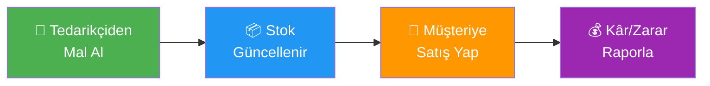
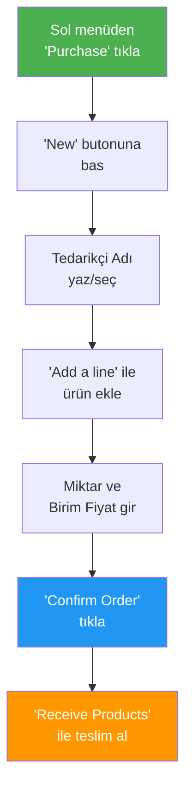
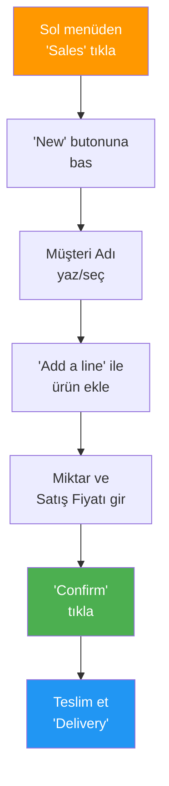
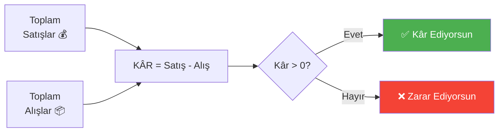

# 📦 Moduon Kağıt & Ambalaj İşi - Kullanım Rehberi

> Bu rehber, Odoo ERP sistemini ambalaj/kağıt ticaret işiniz için nasıl kullanacağınızı adım adım anlatmaktadır.

## 🔄 İş Akışı Özeti

**Basit iş döngüsü:**
1. Tedarikçiden mal alırsınız → **Alış Emri** kaydedersiniz
2. Müşteriye satış yaparsınız → **Satış Emri** kaydedersiniz
3. Kâr/zarar durumunuzu → **Raporlar** sayfasından görürsünüz

---

## 📥 Mal Alışı Kaydetme (Purchase Order)

Tedarikçiden mal aldığında bu adımları izle:

### Adım Adım:

**1.** Sol menüden **Purchase** (Satın Alma) sekmesine girin

**2.** Sağ üstteki **"New"** butonuna tıklayın

**3.** **Vendor (Tedarikçi)** alanına tedarikçinin adını yazın
   - İlk seferde "Create" deyip yeni tedarikçi oluşturun
   - Sonraki seferlerde listeden seçin

**4.** **"Add a line"** ile ürün ekleyin:

| Alan | Açıklama | Örnek |
|---|---|---|
| **Product** | Ürün seçin | Kasap Kağıdı (kg) |
| **Quantity** | Miktar | 50 |
| **Unit Price** | Birim fiyat (₺) | 25.00 |

**5.** Birden fazla ürün alıyorsanız, tekrar "Add a line" yapın

**6.** **"Confirm Order"** butonuna basarak siparişi onaylayın

**7.** Mal elinize geçince **"Receive Products"** → **"Validate"** ile teslim alın

> [!IMPORTANT]
> Birim fiyat, **alış fiyatınızdır** (maliyetiniz). Bu fiyat otomatik olarak kâr hesabında kullanılacaktır.

---

## 📤 Satış Kaydetme (Sales Order)

Müşteriye mal sattığında bu adımları izle:

### Adım Adım:

**1.** Sol menüden **Sales** (Satış) sekmesine girin

**2.** **"New"** butonuna tıklayın

**3.** **Customer (Müşteri)** alanına müşteri adını yazın
   - İlk seferde "Create" ile yeni müşteri ekleyin
   - Örnek: "Ali Kasap", "Tatlıcı Mehmet"

**4.** **"Add a line"** ile satılan ürünleri ekleyin:

| Alan | Açıklama | Örnek |
|---|---|---|
| **Product** | Ürün seçin | Karton Bardak 7oz (100lü) |
| **Quantity** | Miktar | 10 |
| **Unit Price** | Satış fiyatı (₺) | 65.00 |

**5.** **"Confirm"** butonuna basın

**6.** Ürünleri teslim ettiyseniz **"Delivery"** → **"Validate"** yapın

> [!TIP]
> Satış fiyatı ürün kartında varsayılan olarak ayarlıdır. Müşteriye özel fiyat vermek isterseniz satırda değiştirebilirsiniz.

---

## 📊 Kâr / Zarar Takibi

### Raporları Görüntüleme:

**1. Satış Raporu:**
- **Sales** → **Reporting** → **Sales** menüsünden
- Toplam satış gelirini, en çok satan ürünleri görürsünüz

**2. Alış Raporu:**
- **Purchase** → **Reporting** menüsünden
- Toplam maliyetlerinizi görürsünüz

**3. Kâr Hesabı:**
- **Kâr = Toplam Satış Geliri - Toplam Alış Maliyeti**
- Satış raporundaki toplam ile alış raporundaki toplamı karşılaştırın

> [!NOTE]
> Her ürünün alış fiyatı (Cost) ve satış fiyatı (Sales Price) arasındaki fark, o üründen elde ettiğiniz kâr marjıdır.

---

## 📋 Mevcut Ürün Listeniz

Sisteme önceden yüklenmiş ürünleriniz:

### Kağıt Ürünleri
| Ürün | Alış (₺) | Satış (₺) | Kâr Marjı |
|------|----------|-----------|-----------|
| Kasap Kağıdı (kg) | 25 | 35 | %40 |
| Yağlı Kağıt (kg) | 28 | 40 | %43 |
| Kese Kağıdı (kg) | 20 | 30 | %50 |
| Ambalaj Kağıdı (kg) | 22 | 32 | %45 |

### Karton Ürünler
| Ürün | Alış (₺) | Satış (₺) | Kâr Marjı |
|------|----------|-----------|-----------|
| Karton Bardak 7oz (100lü) | 45 | 65 | %44 |
| Karton Bardak 12oz (50li) | 38 | 55 | %45 |
| Karton Yemek Kabı (100lü) | 60 | 85 | %42 |
| Karton Kutu (25li) | 30 | 45 | %50 |

### Peçete & Havlu
| Ürün | Alış (₺) | Satış (₺) | Kâr Marjı |
|------|----------|-----------|-----------|
| Peçete (500lü) | 30 | 45 | %50 |
| Kağıt Havlu (6lı) | 50 | 70 | %40 |
| Masa Örtüsü Kağıt (Rulo) | 38 | 55 | %45 |

### Poşet & Ambalaj
| Ürün | Alış (₺) | Satış (₺) | Kâr Marjı |
|------|----------|-----------|-----------|
| Alüminyum Folyo 30cm | 35 | 50 | %43 |
| Streç Film | 40 | 55 | %38 |
| Buzdolabı Poşeti (Rulo) | 15 | 25 | %67 |
| Çöp Poşeti Büyük (10lu) | 12 | 20 | %67 |

---

## ➕ Yeni Ürün Ekleme

Yeni bir ürün geldiğinde:

**1.** Sol menüden **Inventory** → **Products** gidin

**2.** **"New"** butonuna tıklayın

**3.** Aşağıdaki bilgileri doldurun:

| Alan | Açıklama | Örnek |
|---|---|---|
| **Product Name** | Ürün adı | Pişirme Kağıdı (Rulo) |
| **Sales Price** | Satış fiyatı | 45.00 ₺ |
| **Cost** | Alış fiyatı | 30.00 ₺ |
| **Product Type** | Ürün tipi | Consumable |
| **Category** | Kategori | Kağıt Ürünleri |

**4.** **"Save"** ile kaydedin

> [!TIP]
> Fiyatlar değiştiğinde, ilgili ürünü bulup **Sales Price** veya **Cost** kısmını güncelleyebilirsiniz.

---

## 👥 Müşteri / Tedarikçi Ekleme

Yeni bir müşteri veya tedarikçi ile çalışmaya başladığında:

**1.** Sol menüden **Contacts** gidin

**2.** **"New"** butonuna tıklayın

**3.** İsim, telefon, adres gibi bilgileri doldurun

**4.** **"Save"** ile kaydedin

> Bu kişileri artık alış ve satış emirlerinde seçebilirsiniz.

---

## ❓ Sık Sorulan Sorular

**S: Fiyat değişince ne yapmalıyım?**
Inventory → Products → İlgili ürüne tıklayın → Sales Price veya Cost'u güncelleyin.

**S: Yanlış kayıt girdiysem ne yapabilirim?**
İlgili siparişe gidip "Cancel" yapabilir, düzenleyip tekrar onaylayabilirsiniz.

**S: Ürünler listede görünmüyor?**
Arama çubuğunda "Archive" filtresini kaldırın. Tüm ürünlerin aktif olduğundan emin olun.

**S: Sisteme telefondan erişebilir miyim?**
Evet! Herhangi bir cihazdan `https://webster-strikes-saint-lounge.trycloudflare.com` adresine girerek sistemi telefonda kullanabilirsiniz.
